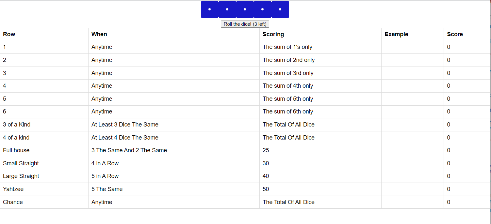

## Try it out (https://yahtzee-reactjs-app.herokuapp.com/)
<br>

# Yahtzee 
This is a simple implementation of the classic dice game, Yahtzee, built using React. Players roll dice to create specific combinations and score points.

# Table of Contents
- Features
- Installation
- Usage
- Features
- Roll dice up to three times per turn
- Hold specific dice to keep their values between rolls
- Track scores for various combinations (e.g., ones, twos, threes, etc.)
- Automatically update scores based on dice combinations
- Asynchronous updating of scores as the game progresses

# Installation
Before you can run the application, you need to have Node.js and npm (Node Package Manager) installed on your computer. You can download Node.js from the official website: https://nodejs.org/

To install the project, follow these steps:

Clone the repository:
    
```bash
git clone https://github.com/MohammedMahmud/Yahtzee.git

```


Move to the project directory:
    
```bash
cd Yahtzee
```

Install the required dependencies:

```bash
npm install
```

Usage
To start the development server and run the application, execute the following command:

```bash
npm start
```


This will open the application in your default web browser at http://localhost:3000/

To play the game, roll the dice by clicking the "Roll" button. You can hold specific dice by clicking on them, which will prevent them from being rolled again. You have up to three rolls per turn to create specific combinations and score points. The scores will be automatically updated as the game progresses.

If you want to restart the game, click the "Restart Game" button at the top of the page. This will reset the scores and dice rolls, allowing you to start a new game.

# Screenshots of the Game


